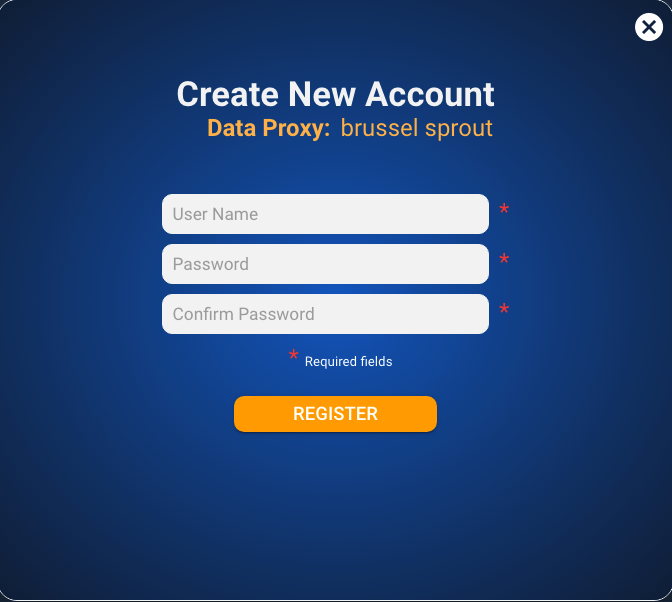

# Create Account

The create account screen is opened from the [Home Page](home-page.md) and is the screen where every new account is created/registered.

**Captions**

| Text               | Type    | Comments                           |
| ------------------ | ------- | ---------------------------------- |
| Create New Account | Static  |                                    |
| Data Proxy         | Static  |                                    |
| \[proxy name]      | Dynamic | Value set in config-dataproxy.json |
| \*Required fields  | Static  |                                    |

**Inputs**

| Name             | Constraints                               | Placeholder Text |
| ---------------- | ----------------------------------------- | ---------------- |
| User Name        | 
Max Length: 24

Min Length: 8
 | User name        |
| Password         | 
Max Length: 40

Min Length: 8
 | Password         |
| Confirm Password | 
Max Length: 40

Min Length: 8
 | Confirm Password |

**Actions**

| Caption  | Type   | Action                                                                                    |
| -------- | ------ | ----------------------------------------------------------------------------------------- |
| REGISTER | Button | Validate all fields and then return to the [Home Page](home-page.md)                      |
| X        | Image  | Close the screen without adding a new account and return to the [Home Page](home-page.md) |

**Validation**

| **Exception**                              | Error Message                               |
| ------------------------------------------ | ------------------------------------------- |
| No user name                               | Username not entered                        |
| No password                                | Password not entered                        |
| Password too short                         | Password must be at least 8 characters      |
| No confirm password                        | Confirm password not entered                |
| Password and confirm password not the same | Password and Confirm Password are different |


**Note**: For the first release there will be no additional validation on the password format for strength or special characters etc. The only constraint is that the length must be >=8 and <= 40 characters.

