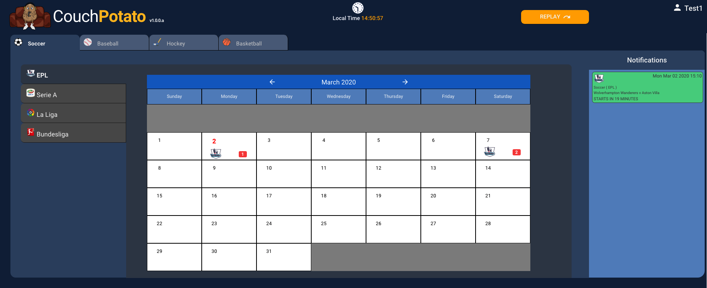

# Dashboard

The dashboard is the main screen and is opened from the [Home Page](../home-page.md) as soon as the user is logged in.

The components of the dashboard are:


[header.md](header.md)



[sports-tabs.md](sports-tabs.md)



[league-tabs.md](league-tabs.md)



[calendar.md](calendar.md)



[notifications.md](notifications.md)



[replay.md](replay.md)



[account-menu.md](account-menu.md)

