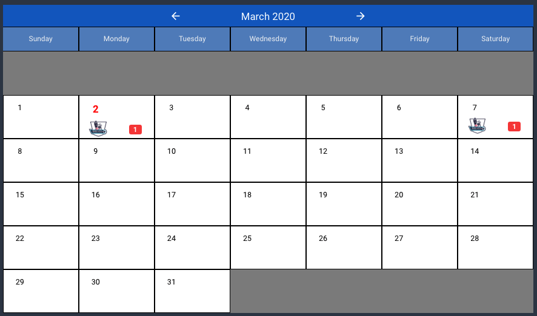

# Calendar

The calendar component is the main 'engine' of the application. It's here that the user will navigate through, enter and select new games.

The calendar will dynamically create a month plan for each month selected using the forward (>) and backward (<) selectors. There will be no upper or lower limits for the first release.

Every time the calendar changes from December -> January or January <- December the year will change accordingly.

The numbers of days will be adjusted for each month and take into account leap years.

Weekdays will be displayed as Sunday -> Saturday.

The current day should be a different colour and larger than the other days.

Moving the cursor over any day cell will highlight it.

#### League Crest

If a day has at least one game scheduled then the crest for the league associated with the current calendar will be shown in that day cell.

#### Game Counter

If a day has at least one game scheduled then a badge for the total number of games will be shown in that day cell.

### **Captions**

| Text            | Type    | Comments                                                                                 |
| --------------- | ------- | ---------------------------------------------------------------------------------------- |
| \[Month]        | Dynamic | Changes according to the selected month.                                                 |
| \[Year]         | Dynamic |  Changes according to the movement of the month.                                         |
| Day Names       | Static  | Sunday thru Saturday                                                                     |
| \[Day Number]   | Dynamic | Generated according to the number of days in the month and the day name of the first day |
| \[League Crest] | Dynamic | Depends on the sport and league for the calendar at the time.                            |
| \[Game Counter] | Dynamic | The number of games for the date, sport, league in any given day cell.                   |

### **Actions**

| Caption     | Type   | Action                                               |
| ----------- | ------ | ---------------------------------------------------- |
| <           | Text   | Move month forward                                   |
| >           | Text   | Move month backward                                  |
| \[Day Cell] | Button | Open the [Game Selector](../game-selector.md) screen |
