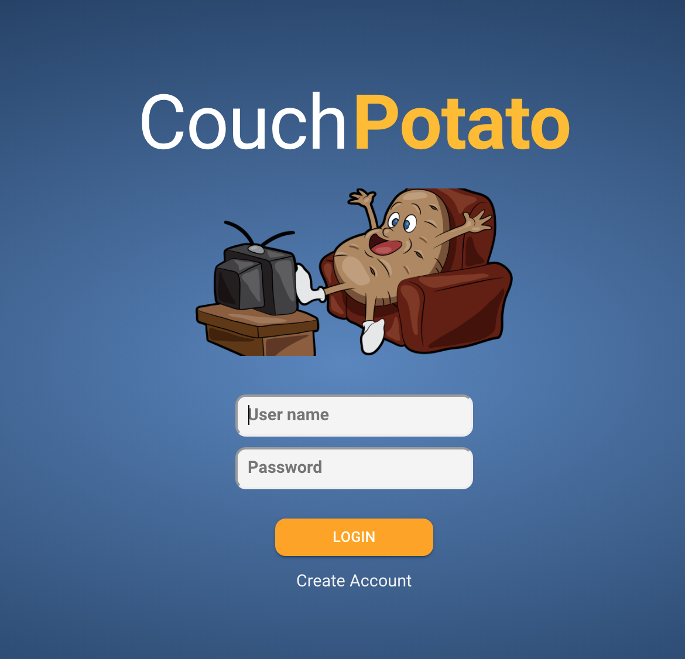

# Home Page

The home page will be the first page to load and from where the user will be able to login or create an account.

### **Inputs**

| Name      | Constraints                               | Placeholder Text |
| --------- | ----------------------------------------- | ---------------- |
| User Name | 
Max Length: 24

Min Length 8
  | User name        |
| Password  | 
Max Length: 40

Min Length: 8
 | Password         |

### **Actions**

| Caption        | Type   | Action                                                                    |
| -------------- | ------ | ------------------------------------------------------------------------- |
| LOGIN          | Button | Validate user name and password and then open the [Dashboard](dashboard/) |
| Create Account | Text   | Open the [Create Account](create-account.md) screen                       |

### **Validation**

| **Exception**                    | Error Message                |
| -------------------------------- | ---------------------------- |
| No user name                     | Username not entered         |
| No password                      | Password not entered         |
| Password or user name is invalid | Invalid username or password |

### **Assets**

