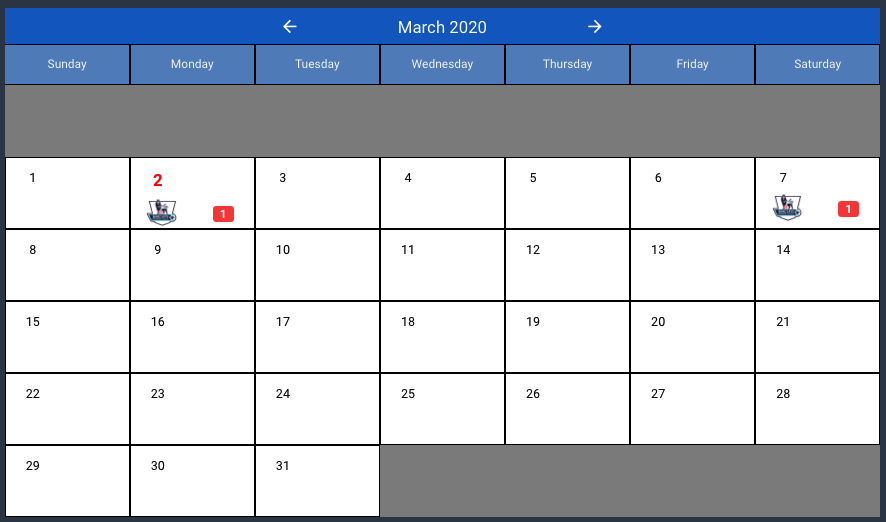
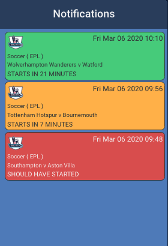

# Dashboard

The dashboard is the main screen from where you can navigate around the features of the application in preparation for inputting data.

The dashboard sis opened as soon as you log in from the  [Home Page](../home-page.md).

The dashboard is best thought of as five feature sections:

1. Header
2. Sport Tabs
3. League (event Group) Tabs
4. Calendar
5. Notifications

## Header

The dashboard header is shown at the top of the screen and is non-scrollable. That is to say that if you run  the application on a small display such that you have to scroll up and down, to see all of the dashboard, the header is always 'pinned' to the top of the screen.

The features of the header are:

* Application version number.
* Real time clock.
* Data Replay button. See [Replay](replay.md).
* User name.
* User icon for opening the account menu. See [Account Menu](account-menu/).

## Sports Tabs

The sports tab runs horizontally across the dashboard and displays one tab for each sport that is enabled. The tabs are dynamic and configured through a database table that can have new sports added or deleted at any time

There is no limit on the number of sports tabs that can be created. If the tabs reach the horizontal limit of the application then they will stack in to multiple rows.&#x20;

By clicking on any tab you will:

1. Update the Leagues Tabs to show only the leagues associated with the selected sport.
2. Change the calendar display to show only events for the selected sport and league.

When you select a sports tab the league will default to the first one in the list.

## League Tabs

The leagues tab runs vertically down the left side of the dashboard and displays one tab for each league that is configured for the selected sport. The tabs are dynamic and configured through a database table so that new leagues can be added or deleted at any time.

There is no limit on the number of sports tabs that can be created. If the tabs reach the vertical limit of the application then they will stack in to multiple columns.&#x20;

If you click on any of the tabs the calendar will show only events for the selected sport and league.

## Calendar 

The calendar component is the main 'engine' of the application. It's here that you'll navigate, enter and select new games.

The calendar dynamically creates a month plan for each month selected using the forward (>) and backward (<) selectors. There is no limit on the number of months/years that can scrolled through.

As you move the cursor over any cell it'll be highlighted , and the current day is displayed as a solid number.

#### League Crest

If a day has at least one game scheduled then the crest for the league associated with the current calendar will be shown in that day cell.

#### Game Counter

If a day has at least one game scheduled then a badge for the total number of games will be shown in that day cell.

To enter new games click on any day cell and the game selector for that sport / league / date combination will be shown.

## Notifications 

The notifications panel is displayed on the right side of the dashboard and is where all notifications (reminders) will be posted for any games about to start or finish.

Each notification takes the form of a 'note' which has the following attributes:

### Colours

The colour of the notes is very important and must be visibly obvious. The colour of the note is set by the following criteria:

**Green**

* Any game that is in the range 30 - 15 minutes to it's scheduled start time.
* Any game that is in the range 30 - 15 minutes from it's predicted end time.

**Amber**

* Any game that is in the range 1 - 14 minutes to it's scheduled start time.
* Any game that is in the range 1 - 14 minutes from it's predicted end time.

**Red**

* Any game that should have started according to its scheduled start time.
* Any game that is in the range 30 - 15 minutes to it's predicted end time.

### Start and End Times

The notifications rely on the start and end times of each game. The start time is taken as the time entered for any game when it was created.

The end time is more complicated because for many sports it's very hard to predict when a game ends because of time-outs, extra-time etc. For example, a game of soccer is much more predictable because the clock doesn't stop during play. So a game is likely to be two halves of 45 minutes, 15 minutes of half-time and perhaps 5 minutes of extra time, so 45+45+15+5 = 110 minutes.

However, a game of football, even thought it's four quarters of 15 minutes, has time-outs and regular clock stops, so the time the game will finish is a very broad average.

### Removing Notes

Each note is tied to a game and as such will be automatically removed from the notification panel as soon as the status of the game is updated. For example, if a note states that game x "SHOULD HAVE STARTED", then as soon as the game is started, using the game selector, the note will be removed.

To keep things tidy notes can be set to be be automatically removed after a set interval (in hours). This means that if games haven't been started, instead of the warning note appearing even after \[x] days when there would be no point updating the status of the game, it will be removed.

You can set the number of hours after which a notes should be removed is set in the `notifications->end` property in `config-dataproxy.json.` The default value is 240 (10 days).

### Hyperlinking

Each note is 'clickable', so if you click on it you will automatically open the game selector for the selected date / league / sport combination. The game in the selector, that corresponds to the game on the selected note, will be highlighted for easy identification. For more information see:
